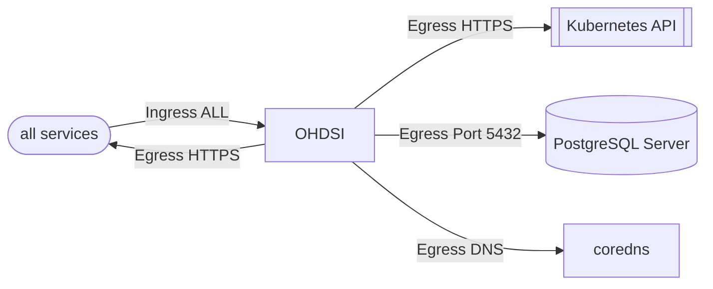

The FluxCD Configuration for the [OHDSI Components](https://www.ohdsi.org/).

The Observational Health Data Sciences and Informatics (or OHDSI, pronounced “Odyssey”) program is a multi-stakeholder, interdisciplinary collaborative to bring out the value of health data through large-scale analytics. All our solutions are open-source.

## Network Policies

| Direction | Ports/Type | Description |
| --- | --- | --- |
| Ingress | All | Allows all traffic inbound. TODO: This needs to be refined |
| Egress | All | Allows all traffic to egress. TODO: This needs to be refined |
| Egress | TCP 5432 | Allows traffic for PostgreSQL |
| Egress | TCP/UDP 53 | Allows traffic for DNS ports |
| Egress | HTTPS | Allows access to the kubernetes service to allow Kubernetes API Access |